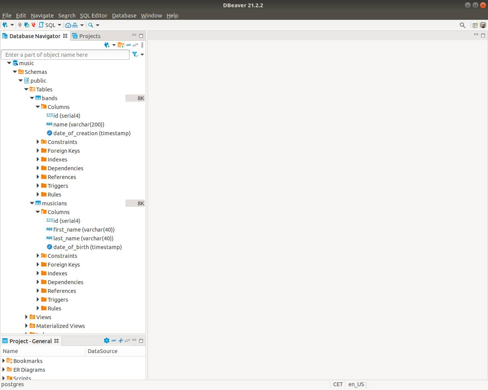
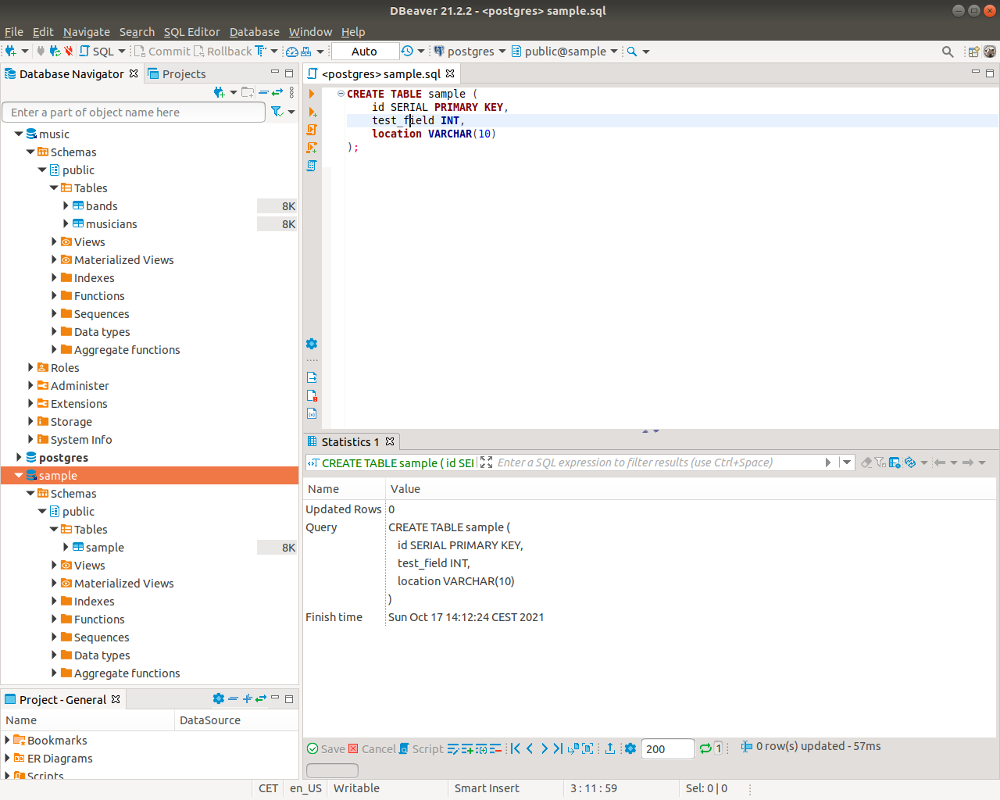

# Interacting with a Database System

## Description

In this exercise, you will focus on how to interact with PostgreSQL using the command-line interface and DBeaver.

## Set up

To do the following tasks, you will need access to a PostgreSQL server and have [DBeaver](https://dbeaver.io/download/) installed in your local computer.

If you haven't done it already, install both.

## Tasks

### 1. Command-line Interface

#### 1.1. Testing the PostgreSQL Server

Connect to PostgreSQL using the command-line interface and the user `postgres`. Then, show a list of all the databases on the server.

**If you just installed PostgreSQL you should see something similar to this:**

```
                                                 List of databases
            Name             |   Owner   | Encoding |   Collate   |    Ctype    |         Access privileges         
-----------------------------+-----------+----------+-------------+-------------+-----------------------------------
postgres                     | postgres  | UTF8     | en_US.UTF-8 | en_US.UTF-8 |
template0                    | postgres  | UTF8     | en_US.UTF-8 | en_US.UTF-8 | =c/postgres
                             |           |          |             |             | postgres=CTc/postgres
template1                    | postgres  | UTF8     | en_US.UTF-8 | en_US.UTF-8 | =c/postgres
                             |           |          |             |             | postgres=CTc/postgres
```


#### 1.2. Running an SQL Script

An SQL script has been provided for you in the file [music.sql](music.sql). Execute its contents (without copying and pasting the statements).

**Your result should look like this:**

```
NOTICE:  database "music" does not exist, skipping
DROP DATABASE
CREATE DATABASE
You are now connected to database "music" as user "postgres".
CREATE TABLE
```

Now, execute it again.

**Now, your result should look like this:**

```
DROP DATABASE
CREATE DATABASE
You are now connected to database "music" as user "postgres".
CREATE TABLE
```

Finally, list again the databases in the server.

**Now, your result should look similar to this:**

```
                                                 List of databases
            Name             |   Owner   | Encoding |   Collate   |    Ctype    |         Access privileges         
-----------------------------+-----------+----------+-------------+-------------+-----------------------------------
postgres                     | postgres  | UTF8     | en_US.UTF-8 | en_US.UTF-8 |
template0                    | postgres  | UTF8     | en_US.UTF-8 | en_US.UTF-8 | =c/postgres
                             |           |          |             |             | postgres=CTc/postgres
template1                    | postgres  | UTF8     | en_US.UTF-8 | en_US.UTF-8 | =c/postgres
                             |           |          |             |             | postgres=CTc/postgres
music                        | postgres  | UTF8     | en_US.UTF-8 | en_US.UTF-8 | =c/postgres
```

### 1.3. Listing the Tables

Connect to the database that was just created and then list all the tables in it.

**Your result should look like this:**

```
           List of relations
 Schema |   Name    | Type  |  Owner   
--------+-----------+-------+----------
 public | bands     | table | postgres
 public | musicians | table | postgres
(1 row)
```

### 1.4. Describing a Table

Describe the table `musicians`.

**Your result should look like this:**

```
                                          Table "public.musicians"
     Column    |            Type             | Collation | Nullable |              Default               
---------------+-----------------------------+-----------+----------+------------------------------------
 id            | integer                     |           | not null | nextval('musicians_id_seq'::regclass)
 first_name    | character varying(40)       |           |          |
 last_name     | character varying(40)       |           |          |
 date_of_birth | timestamp without time zone |           |          |
Indexes:
    "musicians_pkey" PRIMARY KEY, btree (id)

```

### 2. DBeaver

#### 2.1. Connecting to the PostgreSQL Server

Open DBeaver and connect to the PostgreSQL server.

> If you are asked to download and install additional libraries, accept it.

Then, find the database that was just created on the previous tasks and explore it until you see the columns of both tables (expand the object tree on the `Database Navigator`).

**Your result should look similar to this:**



#### 2.2. Creating a New Database

Using DBeaver's SQL Editor, create an empty database named `sample` and execute the contents of the file [sample.sql](sample.sql).

This file creates a single table called `sample`.

**Your result should look similar to this:**


